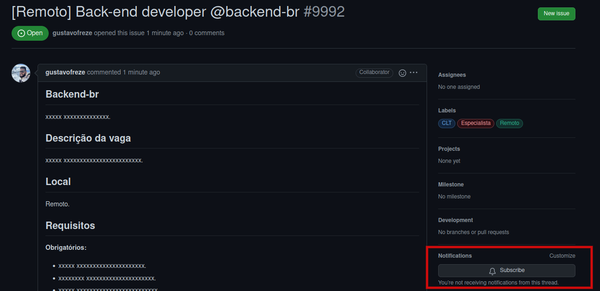

<!--suppress HtmlDeprecatedAttribute -->

  

# Vagas

Espaço para a divulgação de vagas para desenvolvedores back-end via issues do Github.

## Como cadastrar uma vaga?

Abra uma [issue](https://github.com/backend-br/vagas/issues/new/choose), e no título, coloque o **nome da cidade**,
seguido da **descrição da vaga**, e **nome da empresa**. Siga o modelo padrão gerado pela issue.

Adicionalmente, informe quais labels devemos adicionar, contendo o nível de experiência desejada e a forma de contração.

## Como receber atualizações das vagas?

Você pode receber atualizações das vagas no seu e-mail ou via notificações do GitHub, basta clicar **Subscribe**, na
issue que você tem interesse.

    
     
    <tl>Ativar notificações.</tl>

## Outros repositórios de vagas

### Por área

- [Vagas para QAs](https://github.com/qa-brasil/vagas)
- [Vagas para Chat-Bot](https://github.com/chatbotbr/vagas)
- [Vagas para Back-End](https://github.com/backend-br/vagas)
- [Vagas para Front-End](https://github.com/frontendbr/vagas)

### Por tecnologia

- [Vagas para PHP](https://github.com/phpdevbr/vagas)
- [Vagas para .NET](https://github.com/dotnetdevbr/vagas)
- [Vagas para Rust](https://github.com/rustdevbr/vagas)
- [Vagas para Kotlin](https://github.com/kotlin-br/vagas)
- [Vagas para Vue.js](https://github.com/vuejs-br/vagas)
- [Vagas para Android](https://github.com/androiddevbr/vagas)
- [Vagas para Flutter](https://github.com/flutter-brazil/vagas)
- [Vagas para iOS e OSX](https://github.com/CocoaHeadsBrasil/vagas)
- [Vagas para Go/Golang](https://github.com/Gommunity/vagas)
- [Vagas para React/React Native](https://github.com/react-brasil/vagas)

### Por localidade

- [Vagas para no Ceará](https://github.com/CangaceirosDevels/vagas_de_emprego)
- [Vagas para Back-end (Angola)](https://github.com/backend-ao/vagas)
- [Vagas para Front-end (Angola)](https://github.com/frontend-ao/vagas)
- [Vagas para Back-end (Portugal)](https://github.com/backend-pt/vagas)
- [Vagas para Front-end (Portugal)](https://github.com/frontend-pt/vagas)

## Licença

Licenciado sob [MIT](/LICENSE).

## Agradecimento

Agradecemos a comunidade [Front-end Brasil](https://github.com/frontendbr) que nos inspirou, e essa página é um fork
deles.
